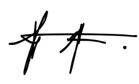
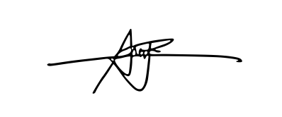

#### Academic Integrity Pledge

This activity is intended to assess our own understanding of the lesson. We affirm that we will complete this problem set **independently** and will not use **Artificial Intelligence tools (such as ChatGPT, Copilot, Gemini, or similar systems)** to generate answers or solutions.

We will rely only on *notes, textbook, and class materials* unless otherwise permitted by the instructor. We understand that submitting work generated or assisted by AI **violates academic integrity** and may result in disciplinary action under university policies.

------------------------------------------------------------------------

#### 1.

**Name:** Abangan, Elijah Kahlil Andres P.

**Signature:**

```{r include-image1, echo=FALSE, out.width="10%"}

```

#### 2.

**Name:** Barago, Sharly Pia Rose S.

**Signature:**

```{r include-image2, echo=FALSE, out.width="10%"}

```

#### 3.

**Name:** Go, Andrei Benedict A.

**Signature:**

```{r include-image3, echo=FALSE, out.width="5%"}

```

#### 4.

**Name:** Muñoz, Nash Adam G.

**Signature:**

```{r include-image4, echo=FALSE, out.width="5%"}

```

#### 5.

**Name:** Pastoriza, Alniño Manwil E.

**Signature:**

```{r include-image5, echo=FALSE, out.width="10%"}

```

#### 1.) Use the bisection method with a hand calculator or computer to find the real root of $x^3 - x - 3 = 0$. Use an error tolerance of $\epsilon = 0.0001$. Graph the function $f(x) = x^3 - x - 3$ and label the root.

**Solution:**

Finding the root using bisection, given $[a,b]=[1,2]$.

```{r, echo=TRUE}
f_x <- function(x){x^3-x-3}
a <- 1
b <- 2
tol <- 0.0001

bisection_table <- list(
  "Iteration" = c(),
  "a" = c(),
  "b" = c(),
  "c" = c(),
  "f_c" = c(),
  "Err." = c()
)

# Bisection Method Algorithm
iters <- 1
repeat {
  c <- (a + b) / 2
  abs_err <- abs(b - c)
  f_c <- f_x(c)
  
  bisection_table$Iteration <- c(bisection_table$Iteration, iters)
  bisection_table$a <- c(bisection_table$a, a)
  bisection_table$b <- c(bisection_table$b, b)
  bisection_table$c <- c(bisection_table$c, c)
  bisection_table$f_c <- c(bisection_table$f_c, f_c)
  bisection_table$Err. <- c(bisection_table$Err., abs_err)
  
  if(abs_err <= tol){
    break
  }
  
  if(f_x(b) * f_x(c) <= 0){
    a <- c
  } else {
    b <- c
  }
  
  iters <- iters + 1
}

root <- c
bisection_table_df <- as.data.frame(bisection_table)
bisection_table_df
```

$$
\boxed{\text{Therefore, the root is } 1.6717}
$$

```{r, echo=TRUE}
curve(f_x, from=0, to=4, col='red')
abline(h=0)

# a and b
abline(v=1, col='blue')
abline(v=2, col='blue')

# root
points(root, 0)
text(c, 2, paste('f(',round(root, 4),')'))
```

#### 2.) The function $f(x) = -3x^3 + 2e^{\frac{x^2}{2}} - 1$ has values of zero near $x=-0.5$ and $x=0.5$.

a.  What is the derivative of $f$? **Answer:**

$$
\begin{aligned}
f(x) &= -3x^3 + 2e^{\frac{x^2}{2}} - 1 \\
f'(x) &= -9x^2 + 2xe^{\frac{x^2}{2}}
\end{aligned}
$$

$$
\boxed{
\text{Therefore, the derivative of } f \text{ is } -9x^2 + 2xe^{\frac{x^2}{2}}
}
$$

b.  If you begin Newton's method at $x = 1$, which root is reached? How many iterations to achieve an error less than $10^{-5}$? **Answer:**

```{r, echo=TRUE}
f_x <- function(x) { -3*x^3 + 2 * exp(x^2/2) - 1 }
f_prime <- function(x) { 2 * x * exp(x^2 / 2) - 9 * x^2 }
tol <- 0.00001
x_curr <- 1

newton_table <- list(
  "Iteration" = c(),
  "x_curr" = c(),
  "f_x" = c(),
  "f_prime" = c(),
  "x_next" = c(),
  "Err." = c()
)

# Newton's Method Algorithm
iters <- 1
repeat {
  f_curr <- f_x(x_curr)
  f_prime_curr <- f_prime(x_curr)
  
  x_next <- x_curr - f_curr / f_prime_curr
  newton_abs_err <- abs(x_next - x_curr)
  
  newton_table$Iteration <- c(newton_table$Iteration, iters)
  newton_table$x_curr <- c(newton_table$x_curr, x_curr)
  newton_table$f_x <- c(newton_table$f_x, f_curr)
  newton_table$f_prime <- c(newton_table$f_prime, f_prime_curr)
  newton_table$x_next <- c(newton_table$x_next, x_next)
  newton_table$Err. <- c(newton_table$Err., newton_abs_err)
  
  if (newton_abs_err <= tol) {
    break
  }
  
  x_curr <- x_next
  iters <- iters + 1
}

newton_table_df <- as.data.frame(newton_table)
newton_table_df
```

$$
\boxed{\text{Therefore, the root is } 0.8568 \text{ when } x=1 {\text { and the number of iterations needed to achieve an error less than 10-5 is 4 iterations.}}}
$$

c.  Begin Newton's method at another starting point to get the other zero. **Answer: Using the starting point** $x=2$

```{r, echo=TRUE}
x_curr <- 2
newton_table_2 <- list(
  "Iteration" = c(),
  "x_curr" = c(),
  "f_x" = c(),
  "f_prime" = c(),
  "x_next" = c(),
  "Err." = c()
)

iters <- 1
repeat {
  f_curr <- f_x(x_curr)
  f_prime_curr <- f_prime(x_curr)
  
  x_next <- x_curr - f_curr / f_prime_curr
  newton_abs_err <- abs(x_next - x_curr)
  
  newton_table_2$Iteration <- c(newton_table_2$Iteration, iters)
  newton_table_2$x_curr <- c(newton_table_2$x_curr, x_curr)
  newton_table_2$f_x <- c(newton_table_2$f_x, f_curr)
  newton_table_2$f_prime <- c(newton_table_2$f_prime, f_prime_curr)
  newton_table_2$x_next <- c(newton_table_2$x_next, x_next)
  newton_table_2$Err. <- c(newton_table_2$Err., newton_abs_err)
  
  if (newton_abs_err <= tol) {
    break
  }
  
  x_curr <- x_next
  iters <- iters + 1
}

newton_table_2_df <- as.data.frame(newton_table_2)
newton_table_2_df
```

$$
\boxed{\text{Therefore, the root is } 0.8568 \text{ when } x=2}
$$

#### 3.) Use the function from no. 2 and find the root using the secant method where $x_0=0$ and $x_1=1$. Use an error tolerance of $\epsilon = 0.001$.

```{r, echo=TRUE}
secant_table <- list(
  "x_prev" = c(),
  "x_curr" = c(),
  "x_next" = c(),
  "f_x_curr" = c(),
  "f_x_prev" = c(),
  "Error" = c()
)

# Secant Method Algorithm
MySecant <- function(f, x_prev, x, tol, table) {
  f_x_prev <- f(x_prev)
  f_x <- f(x)
  
  num <- x - x_prev
  den <- f_x - f_x_prev
  
  next_x <- x - f_x * (num / den)
  abs_err <- abs(next_x - x)
  
  table$x_prev <- c(table$x_prev, x_prev)
  table$x_curr <- c(table$x_curr, x)
  table$x_next <- c(table$x_next, next_x)
  table$f_x_prev <- c(table$f_x_prev, f_x_prev)
  table$f_x_curr <- c(table$f_x_curr, f_x)
  table$Error <- c(table$Error, abs_err)
  
  if (abs_err <= tol) {
    return(list(root = next_x, table = table))
  } else {
    return(MySecant(f, x, next_x, tol, table))
  }
}

result <- MySecant(f_x, 0, 1, 0.001, secant_table)

secant_table_df <- as.data.frame(result$table)
secant_table_df
```

$$
\boxed{\text{Therefore, the root is } 0.857 \text{ when } x_0=0, x_1=1, \text{ and } \epsilon = 0.001 \text{ using the Secant Method}}
$$

#### 4.) Consider the system of equations:

$$
\begin{cases}
2x + 3y - z = 5 \\
4x - y + 2z = 6 \\
-3x + 2y + z = -4
\end{cases}
$$

a.  Present the augmented matrix of the system. **Answer:**

$$
\boxed{
\left(
\begin{array}{ccc|c}
2 & 3 & -1 & 5 \\
4 & -1 & 2 & 6 \\
-3 & 2 & 1 & -4
\end{array}
\right)
}
$$

b.  Solve the system using $Ax=LUx=Ly=b$ and round the final answer to 4 decimal digits. **Answer:**

```{r, echo=TRUE}
LU <- function(mat){
  upper <- mat
  n <- nrow(mat)
  lower <- diag(n)
  
  for(col in 1:(n-1)){
    for(row in (col+1):n){
      m <- upper[row, col] / upper[col, col]
      lower[row, col] <- m
      upper[row,] = upper[row,] - m * upper[col,]
      print(sprintf("Row Operation: R_%d ← R_%d - (%.2f)R_%d", row, row, m, col))
      print("Upper:")
      print(upper)
      print("Lower:")
      print(lower)
    }
  }
  
  return(list(L = lower, U = upper))
}

A = matrix(c(2, 3, -1, 4, -1, 2, -3, 2, 1), nrow=3, byrow=TRUE)
b = matrix(c(5, 6, -4), nrow=3, byrow=TRUE)
lu_results = LU(A)

L = lu_results$L
U = lu_results$U
n <- nrow(L)

# Solving for y using Ly = b (Forward Substitution)
y <- matrix(0, nrow=3, ncol=1)

for(i in 1:n){
  sum_l <- 0
  if(i > 1){
    for(j in 1:(i-1)){
      sum_l <- sum_l + L[i,j] * y[j,1]
    }
  }
  y[i,1] <- b[i,1] - sum_l
}
print(round(y, 4))

# Solving for x using Ux = y (Backward Substitution)
x = matrix(0, nrow=3, ncol=1)

for(i in 3:1){
  sum_u <- 0
  if (i < n) {
    for(j in (i+1):n){
      sum_u <- sum_u + U[i,j] * x[j,1]
    }
  }
  x[i,1] <- (y[i,1] - sum_u) / U[i,i]
}
print(round(x, 4))
```

$$
\boxed{
\text{Therefore, the solution is } x = (1.6667, 0.5333, -0.0667)
}
$$

c.  Find the residual vector if the correct solution is: $x=1, y=2, z=-1$ **Answer:**

\$\$

\begin{aligned}

r &= b - Ax \\
r &= 

\left(
\begin{array}{c}
5 \\ 6 \\ -4 
\end{array}
\right)

-

\left(
\begin{array}{ccc}
2 & 3 & -1 \\
4 & -1 & 2 \\
-3 & 2 & 1
\end{array}
\right)

\left(
\begin{array}{c}
1 \\ 2 \\ -1 
\end{array}
\right) \\

r &=

\left(
\begin{array}{c}
5 \\ 6 \\ -4 
\end{array}
\right)

-

\left(
\begin{array}{c}
9 \\ 0 \\ 0 
\end{array}
\right) \\

r &= 

\left(
\begin{array}{c}
-4 \\ 6 \\ -4 
\end{array}
\right)

\end{aligned}

\$\$

$$
\boxed{\text{Therefore, the residual vector is } (-4, 6, -4)}
$$

#### 5.) Compute the Frobenius norm, maximum column sum, and maximum row sum of the matrix:

$$
\left(
\begin{array}{ccc}
10.2 & 2.4 & 4.5 \\
-2.3 & 7.7 & 11.1 \\
-5.5 & -3.2 & 0.9
\end{array}
\right)
$$

**Answer:**

$$
\begin{aligned}
||A||_f &= \sqrt{(10.2)^2 + (-2.3)^2 + (-5.5)^2 + (2.4)^2 + (7.7)^2 + (-3.2)^2 + (4.5)^2 + (11.1)^2 + (0.9)^2} \\
||A||_f &= \sqrt{104.04 + 5.29 + 30.25 + 5.76 + 59.29 + 10.24 + 20.25 + 123.21 + 0.81} \\
||A||_f &= \sqrt{359.14} \\
||A||_f &= 18.95098942
\end{aligned}
$$

$$
\begin{aligned}
&\text{Maximum Column Sum} \\
\text{Col. 1} &= |10.2| + |-2.3| + |-5.5| = 18.0 \\
\text{Col. 2} &= |2.4| + |7.7| + |-3.2| = 13.3 \\
\text{Col. 3} &= |4.5| + |11.1| + |0.9| = 16.5 \\
\text{MaxColSum} &= max(18.0, 13.3, 16.5) \\
\text{MaxColSum} &= 18.0
\end{aligned}
$$

$$
\begin{aligned}
&\text{Maximum Row Sum} \\
\text{Row. 1} &= |10.2| + |2.4| + |4.5| = 17.1 \\
\text{Row. 2} &= |-2.3| + |7.7| + |11.1| = 21.1 \\
\text{Row. 3} &= |-5.5| + |-3.2| + |0.9| = 9.6 \\
\text{MaxRowSum} &= max(17.1, 21.1, 9.6) \\
\text{MaxRowSum} &= 21.1
\end{aligned}
$$

$$
\begin{aligned}
||A||_f &= 18.95098942 \text{, Frobenius Norm} \\
||A||_1 &= 18.0 \text{, Maximum column sum} \\
||A||_\infty &= 21.1 \text{, Maximum row sum}
\end{aligned}
$$

#### 6.) Solve the system of equations given in no. 4, starting with the initial vector of $[0,0,0]$:

```{r, echo=TRUE}
# Preprocessing the LUD matrices
A = matrix(c(2, 3, -1, 4, -1, 2, -3, 2, 1), nrow=3, byrow=TRUE)
b = matrix(c(5, 6, -4), nrow=3, byrow=TRUE)

# This function returns the Lower Triangle, Upper Triangle, and Diagonal Matrices
LUD_jacobi <- function(mat){
  n <- nrow(mat)
  lower <- matrix(0, nrow=n, ncol=n)
  upper <- matrix(0, nrow=n, ncol=n)
  diag  <- matrix(0, nrow=n, ncol=n)
  
  for(i in 1:n){
    diag[i,i] <- mat[i,i]
    j <- 1
    while(j <= (i-1)){
      lower[i,j] <- mat[i,j]
      upper[j,i] <- mat[j,i]
      j <- j + 1 
    }
  }
  
  return(list(L = lower, U = upper, D = diag))
}

LUD_results <- LUD_jacobi(A)

# Lower Triangle
L <- LUD_results$L
L

# Upper Triangle
U <- LUD_results$U
U

# Diagonal
D <- LUD_results$D
D
```

a.  Solve using the Jacobi method with 2-digit precision. **Answer: The system of equations cannot guarantee convergence using the Jacobi Method since it violates the condition wherein the diagonal values must be greater than or equal to the sum of its non-diagonal entries in the same row. Even, rearranging the rows to satisfy the diagonally dominant condition is futile.** $$
    \boxed{
    \text{Therefore, it cannot be solved using the Jacobi Method}
    }
    $$

```{r, echo=TRUE}
# Example Divergence with 5 iterations (Jacobi Method)
x <- matrix(0, nrow=3, ncol=1)
for(i in 1:5){
  x <- (-1*solve(D)) %*% (L + U) %*% x + solve(D) %*% b
  print(round(x, digits = 2))
}
```

b.  Solve using Gauss-Seidel method with 2-digit precision. **Answer: Similar with the Jacobi Method, The system of equations cannot guarantee convergence using the Gauss-Seidel Method since it violates the condition wherein the diagonal values must be greater than or equal to the sum of its non-diagonal entries in the same row. Even, rearranging the rows to satisfy the diagonally dominant condition is futile.**

$$
\boxed{
\text{Therefore, it cannot be solved using the Gauss-Seidel Method}
}
$$

```{r, echo=TRUE}
# Example Divergence with 5 iterations (Gauss-Seidel Method)
x <- matrix(0, nrow=3, ncol=1)
for(i in 1:5){
  x <- -1 * solve(L + D) %*% U %*% x + solve(L + D) %*% b
  print(round(x, digits = 2))
}
```

c.  Solve for $\overline{e}$ if the true solution is: $x=1, y=2, z=-1$ **Answer: Using the residual from no. 4,**

```{r, echo=TRUE}
A <- matrix(c(2, 3, -1, 4, -1, 2, -3, 2, 1), nrow=3, byrow=TRUE)
r <- matrix(c(-4, 6, -4), nrow=3, byrow=TRUE)
e <- solve(A) %*% r
round(abs(e), 4)
```

$$
\boxed{
\text{Therefore, } \overline{e} = (0.6667, 1.4667, 0.9333)
}
$$
